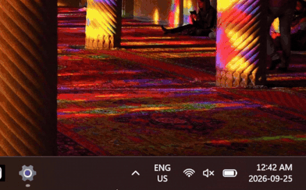

=====

# Welcome to GRID0

> **WIP Notice**: Official hub for GRID0 network routing and client setup. GRID0 is a virtual overlay network bridging all three Switch ecosystems into the same LAN lobby:
* **Emulators** (PC)
* **CFW** (Atmosphère, Modded Switch 1)
* **OFW** (Stock Hardware, Unmodded Switch 1 and Switch 2)

---

## Services

| Ecosystem | Platform / Environment | Core Tool | Connection Method |
| :--- | :--- | :--- | :--- |
| **Emulator** | PC / Steam Deck (Ryujinx, Astris, Eden, etc.) | **GRID0(+) client** | Desktop client binds directly to emulator network adapter. |
| **CFW** | Modded Switch (Atmosphère) | **sys-GRID0(+)** | On-device background sysmodule. No host PC required. |
| **OFW** | Unmodded Stock Switch or Switch 2 | **GRID0 relay** | PC companion application bridges Switch Wi-Fi traffic. |

> **Why the +?** `GRID0+ client` and `sys-GRID0+` are the names for the future versions that will connect to simulated Nintendo servers, with lobbies, matchmaking, and in-game features. That part is still being built. Everything in this guide just gets you onto the GRID0 network itself.

---

## Setup Guides

### 1. Emulator Setup [GRID0-client]

If you play on an emulator you just need the native ZeroTier client.

[video tutorial: complete emulator setup walkthrough for Windows, macOS, and Linux]

#### Windows

1. Download and install **[ZeroTier One](https://www.zerotier.com/download/)**.
2. Right-click the tray icon, select **Join New Network**, and enter:
   `8bd5124fd68185ec`

[image: the Windows system tray with the hidden-icons arrow expanded, pointing at the ZeroTier icon]

#### macOS

1. Download and install **[ZeroTier One](https://www.zerotier.com/download/)**.
2. Click the menu bar icon, select **Join New Network**, and enter:
   `8bd5124fd68185ec`

[image: the macOS menu bar showing the ZeroTier icon and the join network option]

#### Linux

1. Install ZeroTier One:
   `curl -s https://install.zerotier.com | sudo bash`
2. Join the GRID0 network:
   `sudo zerotier-cli join 8bd5124fd68185ec`

[image: a terminal showing the install and join commands with their output]

#### Emulator settings (all platforms)

1. Open your emulator settings (e.g. Ryujinx):
   * Go to **Settings → Network**.
   * Set the multiplayer **Mode** to `Disabled`.
   * Enable **Guest Internet Access/LAN Mode**
   * Remember to click **Apply** and/or **OK**.

[image: Ryujinx settings on the Network tab, with the multiplayer mode and guest internet access options highlighted]

---

### 2. Modded Switch (CFW) [sys-GRID0]

Runs directly on the console as a background sysmodule. No PC or phone required while playing.

[video tutorial: installing sys-GRID0 on a modded Switch, from download to first connection]

1. Download the latest release from the **[sys-GRID0](https://github.com/redluigi323/sys-GRID0/)**.
2. Extract the archive to the root of your SD card.

[image: the SD card root with the extracted sys-GRID0 folders in place]

3. Reboot into Atmosphère and verify connection status using the Tesla (or Ultrahand) overlay menu.

[image: the Tesla overlay open on the Switch showing the sys-GRID0 connection status]

---

### 3. Stock Switch and Switch 2 Setup (OFW) [GRID0 relay]

Stock consoles cannot execute background custom modules. `grid0-relay` runs on a PC connected to the same home network, capturing and translating LAN-Play packets automatically.

[video tutorial: setting up GRID0-relay on PC and connecting a stock Switch, automatic and manual modes]

1. Download and open `GRID0Relay.exe` from the **[GRID0-relay](https://github.com/redluigi323/grid0-relay)** repository.

[image: the GRID0-relay releases page with the download for your system highlighted]

2. `GRID0Relay` will automatically install ZeroTier One and npcap.
   <small>

For certainty:
Make sure they are installed (it should say ZeroTier One and npcap are installed in the `GRID0Relay` settings).
</small>
3. `GRID0Relay` will automatically launch ZeroTier and connect to the GRID0 network.
   <small>

For certainty:
**Windows:** Click the Up arrow at the bottom right of your screen and right-click the ZeroTier tray icon, make sure there is a check mark beside "`GRID0Relay` GRID0. 
   
   
</small>
4. `GRID0Relay` will automatically select the correct ZeroTier adapter.
   <small>

For certainty:
In `GRID0Relay`, open **Settings**, the relay will automatically connect to the presumed ZeroTier connection, but make sure the ZeroTier connection selected looks like the correct one (should be named something similar to ZeroTier).
</small>

[image: the Windows tray with the ZeroTier icon, checkmark visible next to the GRID0 network]

<small>

Automatic Mode (Easier, Windows and Hotspot Capable Only):

5. Go back to the **Play** section of `GRID0Relay`, make sure **Automatic (DHCP)** is selected, click **Set up PC hotspot** if it isn't already set up and click **Start relay**.

[image: the relay Play tab with Automatic (DHCP) selected and Start relay visible]

6. Connect your Switch or Switch 2 to the PC Hotspot normally. If your Switch or Switch 2 was already connected, simply turn on and off either **Sleep Mode** or **Airplane Mode** (both work).

</small>

<small>

Manual Mode:

5. Go back to the **Play** section of `GRID0Relay`, make sure **Manual IP settings** is selected, click **Start relay** and notice the Switch IP settings it provides you.
6. On your Switch or Switch 2, enter **Network Settings**, **Change Settings** on the same network your PC is connected to, and enter the provided IP settings. (Primary DNS can be set to **8.8.8.8** and Secondary DNS can be left blank).

[image: the Switch internet settings screen with the manual IP, subnet, gateway, and DNS fields filled in]
7. Make sure to save and connect to the network.

</small>
